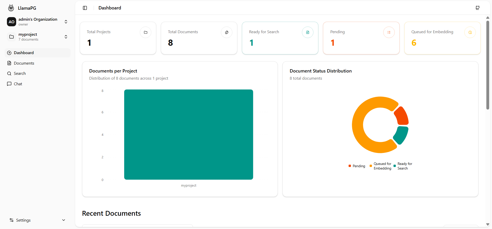

# 🦙 llama-pg

A production-ready multi-tenant RAG as a Service (RaaS) orchestrator for intelligent document parsing, vector embeddings generation, and retrieval-augmented generation—enabling you to automate embeddings across all your projects in one place



## 🚀 Features

- **PDF Processing**: Automatic PDF parsing using [LlamaParse]((https://cloud.llamaindex.ai/)) (or any supported parser)
- **Vector Embeddings**: Built-in support for any embedding model (e.g., BAAI/bge-m3 or OpenAI's text-embedding-3-small)
- **Admin Interface**: Easy-to-use admin panel for organization, project, and document management
- **REST API**: a FastAPI built to support a multi-tenant and multi-project setup
- **Worker Architecture**: Scalable background processing with ARQ workers
- **pgai Integration**: Leverages TimescaleDB's [pgai](https://github.com/timescale/pgai) extension for vector operations

### Pipeline: Document → Embeddings

```
📄 Document Upload
    ↓
🔄 QUEUED (Redis)
    ↓
📝 PARSING (Parser Worker)
    ↓
💾 PARSED (PostgreSQL - TimescaleDB)
    ↓
🤖 VECTORIZING (Vectorizer Worker - pgai)
    ↓
🔍 READY (PostgreSQL - TimescaleDB)
```

## 🛠️ Quick Start

### Prerequisites

- Docker & Docker Compose
- LlamaCloud API key for document parsing (get from [LlamaIndex](https://cloud.llamaindex.ai/))
- OpenAI API key for embeddings (or vLLM with a deployed embedding model)

### vLLM Prerequisites (optional)

If using vLLM, we recommend using an embedding model that supports matryoshka dimensions. We personally tested `BAAI/bge-m3` using the following command:
```
vllm serve BAAI/bge-m3 \
  --task embed \
  --tensor-parallel-size 1 \
  --gpu-memory-utilization 0.8 \
  --no-enable-prefix-caching \
  --trust-remote-code \
  --enforce-eager \
  --host 0.0.0.0 \
  --port 8000 \
  --max-model-len 2048 \
  --override-pooler-config '{"normalize": true}' \
  --hf_overrides '{"is_matryoshka": true, "matryoshka_dimensions": [768,1024]}'

```
### 1. Clone the Repository

```bash
git clone https://github.com/akvnn/llama-pg.git
cd llama-pg
```

### 2. Environment Configuration

Create a `.env` file in the root directory:

Include the required `.env` variables:
```env
OPENAI_API_KEY=<your_openai_key>
LLAMA_CLOUD_API_KEY=<your_llamaparse_api_key_here>
```

Additionally, all possible `.env` variables (including optional ones) are listed here:
```env
# PostgreSQL Configuration
DB_URL=<postgresql://{PG_USER}:{PG_PASSWORD}@{PG_HOST}:{PG_PORT}/{PG_DBNAME}>
DB_POOL_MIN_SIZE=5
DB_POOL_MAX_SIZE=10
DB_POOL_IDLE_TIMEOUT=300
DB_POOL_LIFETIME_TIMEOUT=1800

# Security Configuration
JWT_EXPIRES_IN=3600
JWT_SECRET_KEY=some_dummy_key

# Admin User Configuration
CREATE_DEFAULT_ADMIN_USER=True
ADMIN_USERNAME="admin"
ADMIN_PASSWORD="password"

# vLLM/OpenAI Configuration
OPENAI_API_KEY=<your_openai_key>
OPENAI_EMBEDDING_MODEL=text-embedding-3-small
OPENAI_EMBEDDING_DIMENSIONS=1536
OPENAI_MODEL=gpt-5
USE_VLLM=False
OPENAI_HOST=https://api.openai.com/v1
# Note: to use vLLM, set USE_VLLM to True, OPENAI_HOST to <host_ip:host_port>, and change the OPENAI_EMBEDDING_MODEL and OPENAI_MODEL accordingly

# Parser Configuration
LLAMA_CLOUD_API_KEY=<your_llamaparse_api_key_here>
USE_LLAMA_PARSE=true
LLAMA_PARSE_AUTO_MODE=true

# API Configuration
API_PORT=8000

# Redis Configuration
REDIS_ARQ_HOST=redis
REDIS_ARQ_PORT=6379
REDIS_ARQ_DATABASE=1
REDIS_ARQ_MAX_JOBS=10
```

### 3. Run the stack

**Using Docker:**

```bash
docker-compose up --build -d
```

This will start:
- **PostgreSQL** (TimescaleDB with pgai): `localhost:5432`
- **Redis**: `localhost:6379`
- **API**: API to manage all services `localhost:8000`
- **Admin Panel**: Frontend to interact with the API `localhost:5173`
- **Worker**: Background parsing and vector processing

For local development instructions, see the [Development](#-development) section below (using `uv`). Alternatively, you can use docker compose for development by uncommenting the bind mounts.

## 📚 Usage

### Admin Interface

Access the admin panel at `http://localhost:5173` to:
- Create and manage organizations and projects
- Upload and organize documents
- Monitor processing status
- Search and chat with your documents

### API Endpoints

Simply navigate to `http://localhost:8000/docs` in your browser to access the full API documentation.

## 🔧 Development

### Local Development Setup

#### API

**Using uv (recommended):**
```bash
uv sync
uv run -m src.server
```

#### Frontend

**Using bun (recommended):**
```bash
bun install
bun run dev
```

## 🤝 Contributing

Contributions are welcome! Please open an issue or submit a pull request.

## 📝 License

This project is licensed under the MIT License - see the [LICENSE](LICENSE) file for details.

### Third-Party License

This project uses pgai, which is licensed under the PostgreSQL License.
Copyright (c) Timescale, Inc.